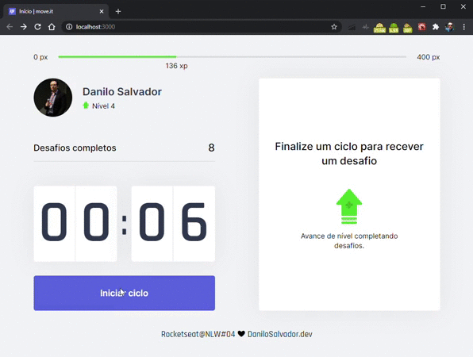

<p align="center">  
    
</p>

<div align="center">


</div>

---

### 📖 Sobre

O Move.it foi desenvolvido durante o evento NLW#04 (Next Level Week 4) da [@Rocketseat](https://github.com/Rocketseat) utilizando NextJS na Trilha de ReactJS em 22 até 28 de fevereiro de 2021.




### 📝 Tecnologias utilizadas

Foram utilizadas as seguintes tecnologias:

- [ReactJS](https://reactjs.org/)
- [TypeScript](https://www.typescriptlang.org/)
- [NextJS](https://nextjs.org/)
- [Vercel](https://vercel.com/)


### ✨ Acesso do Projeto

O projeto foi hospedado na [Vercel](https://vercel.com/) e poderá ser acessado [por aqui](https://moveit.danilosalvador.vercel.app). 


### 💡 Protótipo

O protótipo utilizado foi desenvolvido pela **Rocketseat** e podera ser acessado [por aqui](https://www.figma.com/file/4JjnwdHNLXcxm9H7Os9D5I/Move.it-1.0).


### 🚀 Como Executar o Projeto

```bash
# Clonar o repositório
git clone https://github.com/danilosalvador/nlw04-moveit.git

# Entrar no diretório
cd nlw04-moveit

# Baixar as dependências
`npm install` ou `yarn install`

# Executar
`npm run dev` ou `yarn dev`

```
Acesse  `http://localhost:3000/` em seu navegador.


### 🤖 Próximos passos

Os próximos passos para a evolução do projeto será seguir o prótipo 2.0 desenvolvido pela Rocketseat (que pode ser acessado [por aqui](https://www.figma.com/file/3SLOKw2hSaZY517eTtZEn2/Move.it-2.0)), incluindo as funcionalidades de autenticação e ranking. 


### 📝 Licença
Esse projeto está sob a licença MIT. Veja o arquivo [LICENSE](LICENSE) para mais detalhes.
